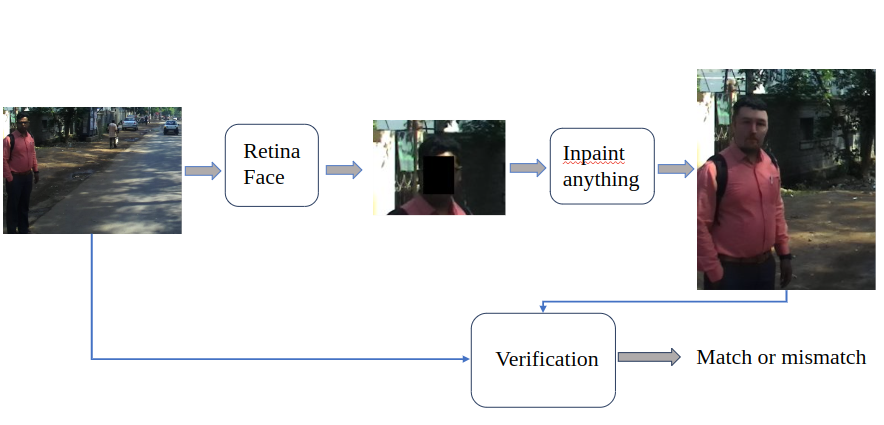

---
# Display name
title: Sandeep Nagar

# Name pronunciation (optional)
name_pronunciation: 

# Full name (for SEO)
first_name: Sandeep
last_name: Nagar

# Status emoji
status:
  icon: ☕️

# Is this the primary user of the site?
superuser: true

# Highlight the author in the author lists. (true/false)
highlight_name: true

# Role/position/tagline
role: Final-year PhD Student 

# Organizations/Affiliations to display in Biography blox
organizations:
  - name: IIIT-Hyderabad
    url: https://iiit.ac.in/

# Social network links
# Need to use another icon? Simply download the SVG icon to your `assets/media/icons/` folder.
profiles:
  - icon: at-symbol
    url: 'mailto:sandeep.nagar@research.iiit.ac.in'
    label: E-mail Me
  - icon: brands/x
    url: https://twitter.com/NaagarRN
  # - icon: brands/instagram
    # url: https://www.instagram.com/srn_naagar
  - icon: brands/github
    url: https://github.com/Naagar
  - icon: brands/linkedin
    url: https://www.linkedin.com/in/sandeepnaagar/
  - icon: academicons/google-scholar
    url: https://scholar.google.com/citations?user=MQQy_T4AAAAJ
  - icon: academicons/orcid
    url: https://orcid.org/0000-0002-4360-8011

affiliates:
  - name: IIIT-Hyderabad
    url: https://iiit.ac.in/  
# add image to `assets/media/` and `featured: true` to display it on the homepage
image:
  filename: avatar.jpg
  focal_point: Smart
  preview_only: false 

interests:
  - Probabilistic Generative Models
  - Theoretical Machine Learning
  - Computer Vision
  - AI4Health, Science

education:
  - area: PhD in Computer Science
    institution: IIIT-Hyderabad, India
    date_start: 2018-08-01
    date_end: 2025-06-15
    summary: |
      - Thesis on _Fast \& Efficient Normalizing Flows and Applications of Image Generative Models_
      - Supervised by [Prof Girish Varma](https://girishvarma.in).
      - Courses:  Advanced Mathematics Structure, Probabilistic Graphical Models, 
        Statistical Methods in Artificial Intelligence, Adv. Robotics: Path Planning and Control, 
        Mobile Robotics: Mechanism and Control, Computer Vision: Digital Image Processing.
    button:
      text: 'Read Thesis'
      url: 'https://researchweb.iiit.ac.in/~sandeep.nagar'
  - area: BTech in Computer Science & Engineering
    institution: Harcourt Butler Technological University - Kanpur, India
    date_start: 2013-08-01
    date_end: 2017-05-15
    summary: |
      Courses included:
      - AI, Machine language (MIPS), Databases, Algorithm, Compiler.
      - Computer Programming, Computer Network, Computer Architecture, Operating System.
      - Compiler Design, Complexity Theory, Theory of Automata \& Formal Languages.
      - Programming in C, Python, Java, Digital Design, Probability, and Statistics.
      - Linear algebra, Discrete Mathematics, Probability, and Statistics.
work:
  - position: Instructor
    company_name: IIIT-Hyderabad
    company_url: 'http://cpro-iiit.github.io/'
    company_logo: 'iiit_logo'
    date_start: 2024-08-01
    date_end: '2024-12-31'
    summary: |2-
      Responsibilities include:
      - M24 CS0.101 Computer Programming:
      - Responsibilities: delivering lectures, developing course material and tutorials, conducting lab sessions, and office hours,
      - Advising and mentoring, guiding, and a course auto-grading platform.
      - Course webpage: http://cpro-iiit.github.io/
  - Position: Research Intern
    company_name: Samsung R & D Institute - Bangalore
    company_url: 'http://cpro-iiit.github.io/'
    company_logo: 'iiit_logo'
    date_start: 2023-08-18
    date_end: '2024-01-12'
    summary: |2-
      Mentor: Dr. [Dendi Sathya Veera Reddy](), [Dr. Pravin Nair](https://www.ee.iitm.ac.in/faculty/profile/pravinnair)
      - Manager: Mr Rajnarayan Gadde
      - Project: Image Super-resolution using Diffusion Models
      - Paper-: Affine-StableSR: Coupling Layer-based Lightweight-Autoencoder and Stable Diffusion Model for Image Super-Resolution.
  - position: Research Assistant
    company_name: Dept. of Ophthalmology and Genomic Medicine, University of Leicester, UK.
    company_url: 'https://devalab.in/'
    company_logo: 'iiit_logo'
    date_start: 2022-08-01
    date_end: '2023-07-15'
    summary: |2-
      Supervisor: [Dr Mervyn G Thomas](https://le.ac.uk/people/mervyn-thomas)
      - Project: Machine learning-based classification of foveal development.
      - Detection of fovea maturity using optical coherence tomography and machine learning.
  - position: Research Assistant
    company_name: Deva Lab, IIIT-Hyderabad
    company_url: 'https://devalab.in/'
    company_logo: 'iiit_logo'
    date_start: 2022-03-01
    date_end: '2022-07-15'
    summary: |2-
      Advisor: Prof. [U. Deva Priyakumar](https://devalab.in/), 
      - Project: Generative models for de novo 3D molecule generation.
      - Designing a normalizing flow-based deep learning model that learns the energy function from data in an end-to-end
        fashion by generating energetically favorable molecular conformations that are more likely to be observed experimentally.
  - Position: Research Intern
    company_name: School of Mathematics and Statistics, University of New South Wales
    company_url: 'https://www.unsw.edu.au/science/our-schools/maths'
    company_logo: 'iiit_logo'
    date_start: 2021-11-01
    date_end: '2022-02-15'
    summary: |2-
      Advisor: Dr. [Rohitash Chandra](https://research.unsw.edu.au/people/dr-rohitash-chandra), 
      - Collaborator: Dr. Ehsan Farabaksh, University of Sydney
      - Project: Autoencoder for Geochemical Anomalies Detection and Lithological Mapping.
      - Journal: [Remote Sensing Framework for Lithological Mapping via Stacked Autoencoders and Clustering](https://doi.org/10.1016/j.asr.2024.09.013).
  - Position: Research Intern
    company_name: Computer Vision and Robotics Lab, University of Illinois Urbana-Champaign, Champaign
    company_url: 'https://vision.ai.illinois.edu/'
    company_logo: 'iiit_logo'
    date_start: 2021-06-01
    date_end: '2021-10-15'
    summary: |2-
      Advisor: Dr. [Narendra Ahuja](https://vision.ai.illinois.edu/narendra-ahuja/) in collaboration with Dr David Beiser, College of Medicine at UIChicago and Dr David Chestekat, UIUC
      - Project: Remote Sensing of Physiological Measurements Using Camera.
      - Paper: R2I-rPPG: Robust Region of Interest Selection for the Remote PPG.
  - position: Research Assistant
    company_name: Machine Learning Lab, IIIT-Hyderabad
    company_url: 'https://mll.iiit.ac.in/'
    company_logo: 'iiit_logo'
    date_start: 2019-06-01
    date_end: '2021-02-15'
    summary: |2-
      Advisor: Dr. [Girish Varma](https://girishvarma.in), 
      - i.) Fast and efficient normalizing flow models and designing an invertible convolutional deep network to learn and
      Generate fake images. 
      - ii.) Designing a flow for the corn seed’s automatic labeling and classification using generative
      models and active learning. 
      - iii.) Panoptic Segmentation Models for the India Driving Dataset. 
      - iv.) Conn seed image dataset for advancement in food and agriculture development -details, code link
  - position: Teaching Assistant,
    company_name: IIIt-Hyderabad
    company_url: 'https://iiit.ac.in/'
    company_logo: 'https://static.talentsprint.com/ts_drupal/talentsprint/images/logo.webp'
    date_start: 2019-01-01
    date_end: 2023-05-31
    summary: |2-
      Course:
      - Linear Algebra, Instructor: Prof Chittaranjan Hens and Prof Siddhartha Das, Spring-23
      - Computer Programming, Instructor: Dr. S Chakraborty, Dr. Varma, and Dr A. Deshpande, Monsoon-22
      - Math for CS: Linear Algebra, Instructor: Prof Girish Varma, Monsoon-22
      - Maths for CS: Probability and Statistics, Instructor: Prof Girish Varma, Monsoon-21
      - Linear Algebra, Instructor: Prof Girish Varma, Spring-21
      - Probability and Statistics, Instructor: Prof Pawan Kumar, Monsoon-20
      - Probability and Statistics, Instructor: Prof Girish Varma, Monsoon-19
      - Computer Network, Instructor: Prof Shatrunjay Rawat, Spring-19

# Skills
# Add your own SVG icons to `assets/media/icons/`
skills:
  - name: Technical Skills
    items:
      - name: Python
        description: ''
        percent: 80
        icon: code-bracket
      - name: Pytorch
        description: ''
        percent: 90
        icon: code-bracket
      - name: C++
        description: ''
        percent: 70
        icon: circle-stack
      - name: CUDA-GPU 
        description: ''
        percent: 60
        icon: circle-stack
  - name: Hobbies
    color: '#eeac02'
    color_border: '#f0bf23'
    items:
      - name: Basketball
        description: ''
        percent: 80
        icon: person-simple-walk
      - name: Piano
        description: ''
        percent: 70
        # icon: music
      - name: Novels
        description: 'Sci-fi, History'
        url: https://www.goodreads.com/review/list/48728408-sandeep-nagar?ref=nav_mybooks
        percent: 50
        # icon: book
        

# languages:
#   - name: English
#     percent: 100
#   - name: Hindi
#     percent: 100

# Awards.
#   Add/remove as many awards below as you like.
#   Only `title`, `awarder`, and `date` are required.
#   Begin multi-line `summary` with YAML's `|` or `|2-` multi-line prefix and indent 2 spaces below.
awards:
  - title: Awarded ACM India-IARCS travel grant
    url: https://www.iarcs.org.in/activities/grants.php
    date: '2025-02-24'
    Awardee: ACM
    # icon: coursera
    summary: |
      ACM India-IARCS travel grants are intended for work directly related to computer science.
  - title: Won 1st Place in NVIDIA Competitions, ICETCI 2023
    url: https://ietcint.com/Ietcint2023/competitions
    date: '2023-08-15'
    awarder: NVIDIA
    # icon: edx
    summary: |
      In the domain of art restoration, develop an innovative computer vision
      a model capable of effectively restoring deteriorated images of art pieces. The goal is to create
      An automated solution that can enhance and reconstruct degraded artworks, improving their
      visual quality while preserving their original characteristics. The model should handle a
      diverse range of deterioration types, including but not limited to noise, blur, scratches, fading,
      and other common forms of degradation.
  - title: Awarded one-year iHub-Data PhD Fellowship
    url: https://ihub-data.iiit.ac.in/index.html
    # certificate_url: https://www.datacamp.com
    date: '2023-08-01'
    Awardee: iHub-IIITH
    # icon: datacamp
    summary: |
      Project Proposal: Fast \& Efficient Normalizing Flows and Applications of Image Generative Models.
      The iHub-Data PhD Fellowship is a one-year fellowship program that provides financial support to PhD students working on data science and AI research projects. The fellowship is designed to support students in the final stages of their PhD research, helping them to complete their work and prepare for their future careers in academia or industry.
---

## About Me

Hi!  I am a final-year PhD student at [Machine Learning Lab](https://mll.iiit.ac.in/), [IIIT-Hyderabad](https://iiit.ac.in/), India, under the guidance of [Prof. Girish Varma](https://girishvarma.in/). My research primarily focuses on Probabilistic Generative Models (Normalizing Flows), Theoretical Machine Learning, and Deep Learning, with applications in Computer Vision.

I have industry experience from my semester at Samsung Research, where I worked with [Dr. Sathya Reddy](https://scholar.google.com/citations?user=My9GRC0AAAAJ&hl=en) and [Dr. Pravin Nair](https://www.ee.iitm.ac.in/faculty/profile/pravinnair) on Generative Models for Image Super-Resolution. Additionally, I have completed research internships at:
- [CVR Lab](https://vision.ai.illinois.edu/), University of Illinois, under the guidance of Prof. [Narendra Ahuja](https://vision.ai.illinois.edu/narendra-ahuja/) in collaboration with Dr. David Beiser and Dr. David Chestekat at the College of Medicine at the University of Illinois, Chicago.
- School of Mathematics and Statistics, University of New South Wales, Sydney, under the guidance of Prof. [Rohitash Chandra](https://research.unsw.edu.au/people/dr-rohitash-chandra) and Dr. Ehsan Farahbakhsh in collaboration with the School of Geosciences, The University of Sydney, Australia.

I hold a B.Tech degree in Computer Science \& Engineering from [Harcourt Butler Technical University - Kanpur](https://hbtu.ac.in/), India. I am from [Greater Noida](https://en.wikipedia.org/wiki/Greater_Noida), India. Beyond research, I am passionate about building and developing innovative ML solutions. I am also an avid reader; feel free to check out my collection of intriguing novels on [Goodreads](https://www.goodreads.com/review/list/48728408-sandeep-nagar?ref=nav_mybooks).

 <!-- I spent one semester at Samsung Research working with [Dr. Sahtya Reddy](https://scholar.google.com/citations?user=My9GRC0AAAAJ&hl=en) and [Dr. Pravin Nair](https://www.ee.iitm.ac.in/faculty/profile/pravinnair) on Generative Models for Image Super-resolution. Previously, I have completed research internships at [CVR Lab](https://vision.ai.illinois.edu/), University of Illinois, under the guidance of Prof. [Narendra Ahuja](https://vision.ai.illinois.edu/narendra-ahuja/) in collaboration with Dr. David Beiser and Dr. David Chestekat at the College of Medicine at the University of Illinois, Chicago. I have also completed a research internship at the School of Mathematics and Statistics, University of New South Wales, Sydney, under the guidance of Prof. [Rohitash Chandra](https://research.unsw.edu.au/people/dr-rohitash-chandra) and Dr. Ehsan Farahbakhsh in collaboration with the School of Geosciences, The University of Sydney, Australia.

I hold a B.Tech degree in Computer Science \& Engineering from [Harcourt Butler Technical University - Kanpur](https://hbtu.ac.in/), India. I am from [Greater Noida](https://en.wikipedia.org/wiki/Greater_Noida), India. I am passionate about creating and building ML ideas. My main research interests include Computer Vision, Probabilistic Generative Models, Theoretical Machine Learning, and Deep Learning.

I’m also an avid reader! Check out my collection of intriguing novels over on [Goodreads](https://www.goodreads.com/review/list/48728408-sandeep-nagar?ref=nav_mybooks). -->

## News and Updates
- 07/2025, Started my Postdoctoral position at the [AI-IDT Lab, TU Munich](https://www.kiinformatik.mri.tum.de/en) under the supervision of Prof. [Benedikt Wiestler](https://ai-idt.github.io/) and Prof. [Anke Meyer-Baese](https://www.sc.fsu.edu/people?uid=ameyerbaese) (Florida State University). 
- 04/2025, Selected for the ["COSPAR Outstanding Paper Award for Young Scientists, 2024"](https://cosparhq.cnes.fr/awards/outstanding-paper-award/) for our [Geo-SAE](https://www.sciencedirect.com/science/article/pii/S0273117724009335) paper.
- 02/2025, Awarded [ACM India-IARCS](https://www.iarcs.org.in/activities/grants.php) travel grant for attending AISTATS`2025.  
- 01/2025, [Inverse-Flow](https://arxiv.org/abs/2410.14634) accepted at [AISTATS`2025](https://aistats.org/aistats2025/index.html).
- 10/2024, Talk and Tutorial on Vision-Transformer, DRDO, India.
- 10/2024, Pre-print [R2I-rPPG](https://arxiv.org/abs/2410.15851): Heart-rate extraction from Video.
- 09/2024, Paper accepted at ICPR`24, [Competition on Safe Segmentation](https://mobility.iiit.ac.in/safe-seg-24/index.html).
- 06/2024, I will be attending [Climate Change AI Summer School 2024](https://www.climatechange.ai/events/summer_school2024).
- 04/2024, We are organizing a [Competition on Safe Segmentation](https://mobility.iiit.ac.in/safe-seg-24/index.html) at ICPR`24.
- 02/2024, Selected for [Oxford Machine Learning Summer School 2024](https://www.oxfordml.school/).
- 09/2023, '[SR SOTA for Art Restoration](https://ieeexplore.ieee.org/abstract/document/10331102)'  accepted at [IEEE ICETCI`23](https://ieeexplore.ieee.org/xpl/conhome/10330803/proceeding).
- 08/2023, Secured 1st Place in [NVIDIA Competitions](https://ietcint.com/user/competitions), [ICETCI`2023](https://ieeexplore.ieee.org/xpl/conhome/10330803/proceeding).
- 08/2023, Awarded one year [iHub-Data PhD Fellowship](https://ihub-data.iiit.ac.in/index.html).
- 07/2023, I will be interning at [Samsung R&D Institute-Bangalore](https://research.samsung.com/sri-b).
- 06/2023, Secured 1st place at [C4MTS CHALLENGE](https://cvit.iiit.ac.in/ncvpripg2023/c4mtschallenge/#awards), [NCVPRIPG 2023](https://events.iitj.ac.in/ncvpripg2023/).
- 03/2023, Won Cash Prize Hackathon, [ML4Science 2023](https://sites.google.com/view/ml4sci/home), GitHub repo [link](https://github.com/ML4Science2023/sMLe_pOdu/tree/main).
- 03/2023, Talk: "Flow models for 3D molecular generation" at [ML4Science 2023](https://sites.google.com/view/ml4sci/home).
- 03/2023, Selected for [Oxford Machine Learning Summer School 2024](https://www.oxfordml.school/).
- 01/2023, Selected for [Research Week with Google 2023](https://sites.google.com/view/researchweek2023/home).
- 02/2023, [FInC Flow](https://arxiv.org/abs/2301.09266) accepted at [VISAPP`23](https://www.scitepress.org/ProceedingsDetails.aspx?ID=trRHWXl/Y5o=&t=1) with oral presentations.
- 02/2022, Awarded one year [iHub-Data MS Fellowship](https://ihub-data.iiit.ac.in/index.html)
<!-- - 01-2024, Selected for Research Internship, [Sony Research India, Bangalore](https://www.sonyresearchindia.com/). -->

<!-- ## Research -->

<!-- ## Preprints

### Data Anonymization in Indian Driving Dataset using Implanting  
**Nagar, S.**, Puttagunta, S., Varma, G.  
*In preparation*  

📄 [Paper](#)  

### Inverse of Convolution for Sparse Blind Deconvolution  
**Nagar, S.**, Varma, G.  
*In preparation*  

📄 [Paper](#)   -->

<!-- --- -->

<!-- # Publications   -->

<!-- ## Deep Generative Models:   -->
<!-- ### [Data Anonymization in Indian Driving Dataset using Implanting](idd_privacy.png)   -->

<!-- 

    
    

        <h3>Data Anonymization in Indian Driving Dataset using Implanting</h3>
        
<strong>Authors:</strong> Nagar, S., Puttagunta, S., Varma, G.

        
<strong>Status:</strong> In preparation

        
📄 [ArXiv](https://arxiv.org/abs/2410.14634)  | 💻 [projectPage](https://naagar.github.io/projectPage_InverseFlow/)

    

 -->

<!-- ### Data Anonymization in Indian Driving Dataset using Implanting  
**Nagar, S.**, Puttagunta, S., Varma, G.  
*In preparation*   -->

<!-- 📄 [Paper](#)   -->

<!-- ### Inverse of Convolution for Sparse Blind Deconvolution  
**Nagar, S.**, Varma, G.  
*In preparation*   -->

<!-- 📄 [Paper](#)   -->

<!-- ### Parallel Backpropagation for Inverse of a Convolution with Application to Normalizing Flows  
**Nagar, S.**, Varma, G.  
*AISTATS 2025*   -->
<!--  -->
<!-- 📄 [ArXiv](https://arxiv.org/abs/2410.14634)  | 💻 [projectPage](https://naagar.github.io/projectPage_InverseFlow/) -->

<!-- ### Affine-Stables: Coupling Layer-based Lightweight Autoencoder and Stable Diffusion Model for Image Super-Resolution  
**Nagar, S.**, Dendi, SVR., Nair, P., Gadde, R. N. 
*Under Review*  

📄 [Preprint](https://scholar.google.com/citations?user=MQQy_T4AAAAJ)  

### ICPR 2024 Competition on Safe Segmentation of Drive Scenes  
Furqan, S. A., **Nagar, S.**, Varma, G.  
*ICPR 2024*  

📄 [ArXiv: 2409.05327](https://arxiv.org/abs/2409.05327) *(Oral)* | 💻 [Competition](https://mobility.iiit.ac.in/safe-seg-24/index.html)

### Remote Sensing Framework for Geological Mapping via Stacked Autoencoders and Clustering  
**Nagar, S.***, Farahbakhsh, E.*, Awange, J., Chandra, R.  
*Advances in Space Research Journal, 2024*  

📄 [DOI](https://doi.org/10.1016/j.asr.2024.09.013)  | 💻 [code](https://github.com/sydney-machine-learning/autoencoders_remotesensing)

### FInC Flow: Fast Invertible Convolutions for Normalizing Flows  
Kallappa, A., **Nagar, S.**, Varma, G.  
*VISIGRAPP 2023*  

📄 [ArXiv](https://arxiv.org/abs/2301.09266) | 💻 [ProjectPage](https://naagar.github.io/project_page_FInCFlow/) *(Oral)*  

### CInC Flow: Characterizable Invertible 3×3 Convolution  
**Nagar, S.**, Dufraisse, M., Varma, G.  
*Workshop on Tractable Probabilistic Modeling, UAI 2021*  

📄 [ArXiv](https://arxiv.org/abs/2107.01358) | 💻 [ProjectPage](https://naagar.github.io/project_page_CInCFlow/) *(Oral)*  

### Automated Seed Quality Testing System using GAN and Active Learning  
**Nagar, S.**, Pani, P., Nair, R., Varma, G.  
*International Conference on Pattern Recognition and Machine Intelligence (PReMI) 2021*  

📄 [ArXiv](https://arxiv.org/abs/2110.00777) | 💻 [Code](https://github.com/Naagar/Seeds_Classification) *(Oral)*  | [Introduced Conr Seeds dataset](https://naagar.github.io/cornseedsdataset)

---

## Computer Vision and Applications:  

### R2I-rPPG: Robust Region of Interest Selection for Remote PPG  
**Nagar, S.**, Alam M., Beiser, D., Ahuja, N.  
*Under Review*  

📄 [ArXiv](https://arxiv.org/abs/2410.15851)  

### Unlocking Simple Features to Predict DFT Spin State Gaps of 3D Metal Complexes using Machine Learning  
Ray, A., **Nagar, S.**, Varma, G., Paul, A.  
*MTMM-SIMS 2024*  

### Adaptation of the Super Resolution SOTA for Art Restoration in Camera Capture Images  
**Nagar, S.**, Bala, A., Patnaik, S. A.  
*IEEE-ICETCI 2023*  

📄 [DOI](https://ieeexplore.ieee.org/document/10331102) | 💻 [Code](https://github.com/Naagar/art_restoration_DM) *(Oral)*  

### C4MTS: Challenge on Categorizing Missing Traffic Signs from Contextual Cues  
Gupta, V., **Nagar, S.**, Choudhury, S. P., Singh, R., Jamwal, A., Gupta, V., Subramanian A., Jawahar, C.V., and Saluja, R  
*NCVPRIPG 2023*

📄 [Springer Link](https://link.springer.com/book/9789819752119) *(Oral)*  

### Remote Heart Rate Estimation from Videos for Minority Populations in Emergency Department  
**Nagar, S.**, Nagar, S. Alam, M., Chatterjee, M., Patel, K., Khosla, S., Harvill, J., Johnson, M. A. H., Chestek, D., Ahuja, N., Beiser, D.
*Illinois College of Emergency Physicians, Spring Symposium 2022* *(Abstract, Oral Presentation)*  

### Respiratory Rate Estimation from Audio Signals from a Public Sound Database  
Chatterjee, M., **Nagar, S.**, Khosla, S., Harvill, J., Johnson, M. A. H., Chestek, D., Ahuja, N., Beiser, D.  
*Illinois College of Emergency Physicians, Spring Symposium 2022* *(Abstract, Oral Presentation)*  

### Respiratory Rate Estimation from Videos for Minority Populations in Emergency Department  
M., Chatterjee, M., Patel, K., **Nagar, S.**, Khosla, S., Harvill, J., Johnson, M. A. H., Chestek, D., Ahuja, N., Beiser, D.
*Illinois College of Emergency Physicians, Spring Symposium 2022* *(Abstract, Oral Presentation)*   -->
